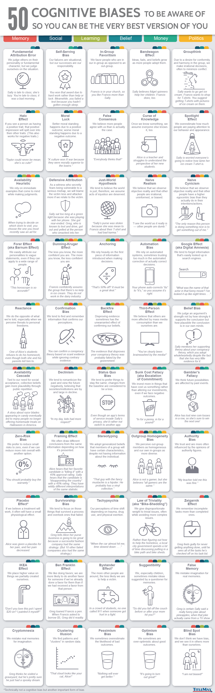

## Understanding and Managing Bias in AI Systems
### Bias
**Definition and Nature of Bias**
- Bias in AI often refers to biases in algorithms, which are procedures for solving problems through defined steps.
- Ethics and responsibility in algorithms emerge when applying them to real-world contexts, not just in mathematical operations.

**Simpson's Paradox and Gender Bias Example**
- The Simpson's paradox illustrates how aggregated data can show different trends than individual group data, complicating bias interpretation.
- In a case of gender bias in university admissions, both claims of discrimination and fairness can be true depending on data aggregation and context.

**Bias in Medical Outcomes**
- Studies show disparities in health conditions between racial groups, but removing bias in algorithms by equalizing health assumptions can lead to harmful outcomes.
- *Context matters*: removing bias in health risk algorithms may reduce necessary screenings for higher-risk groups, negatively impacting care

**Bias in Predictive Policing**
- Predictive policing algorithms can create feedback loops by focusing on areas with prior arrests, disproportionately affecting certain racial groups.
- This feedback loop can perpetuate racial disparities and raises ethical concerns about fairness and the role of policing.

**Heterogeneous Data and Bias**
- Differences in populations (genetic, dietary, community factors) lead to heterogeneous data, which complicates bias removal.
- Bias can exist in both homogeneous and heterogeneous data, requiring careful consideration of when and how to address it.

### What is Bias?
**Definitions and Types of Bias**
- Bias has two main definitions: an ethical/cultural one involving unfair prejudice, and a mathematical one involving systematic distortion in statistics.
- There are many cognitive biases in humans and various biases in AI and machine learning, such as sampling bias, reporting bias, and algorithmic bias.

**Legal Perspective on Bias**
- Protected classes (e.g., race, gender) are legally safeguarded against bias in many jurisdictions.
- Sensitive characteristics are variables that can introduce bias in algorithms but may be necessary for accurate modeling.
- Legal concepts include disparate treatment (intentional bias), disparate outcome (unequal results regardless of intent), equal opportunity, equal accuracy, calibration, and predictive parity.

**Data and Algorithmic Bias**
- Sampling bias occurs when data is not representative of the population.
- Reporting bias happens when only certain outcomes are recorded.
- Historical bias perpetuates past prejudices in current models.
- Algorithmic bias arises from the design or functioning of the algorithm itself.
- Survivorship bias focuses only on data from successful cases, ignoring failures.

**Mathematical and Practical Challenges in Fairness**
- AI models, such as loan approval systems, face trade-offs when applying fairness constraints across different groups with varying data distributions.
- Strategies like maximizing profit, group-unaware models, demographic parity, and equal opportunity each have limitations and can conflict.
- Achieving a universally fair AI system is challenging due to these inherent trade-offs and heterogeneous data.

### Managing AI Bias
### Bias from a Data Perspective
### Reading References
### Understanding and Managing Bias in AI Systems